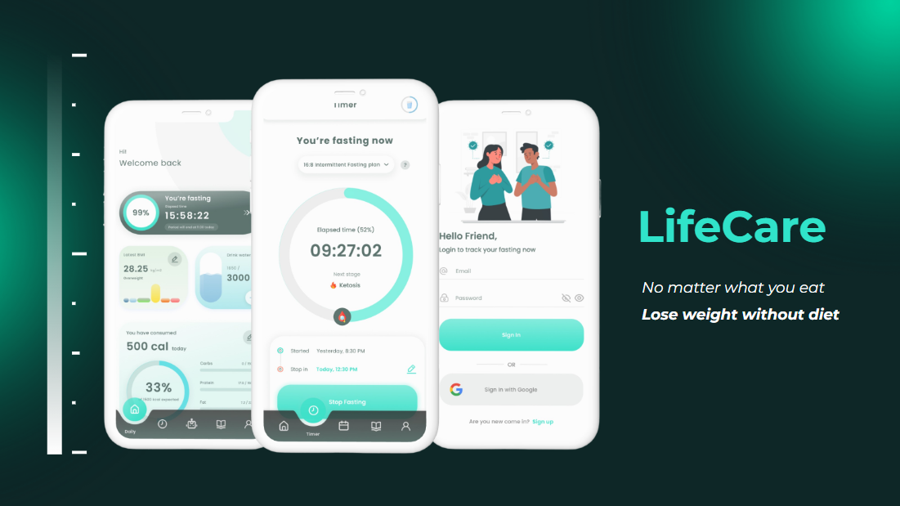
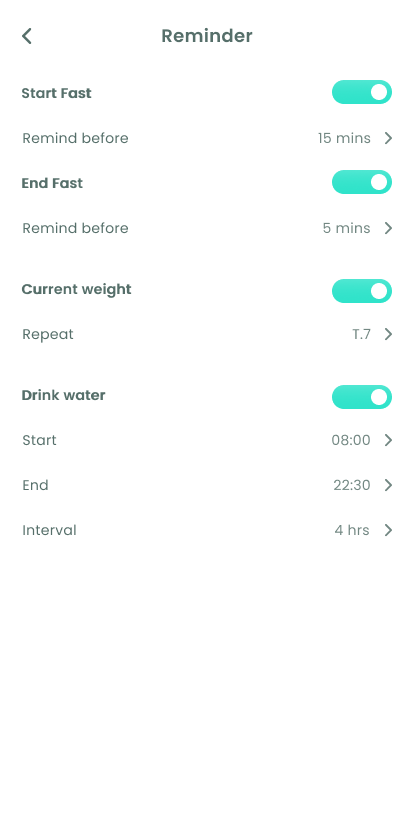

**About LifeCare**

LifeCare is a mobile application designed to support individuals in managing their health and losing weight, focus on user-friendly experiences 

**Developed features:**

- Fasting period tracking
- Hydrate tracking
- Body statistics
- Recommendation
- Reminders
- Offline support

**Tech used:**

- React Native
- React Navigation
- Redux Toolkit, Redux Persist
- Supabase for backend

**Environment requirements:**

- Node 18 to 20.x
- **React Native CLI** is used, follow environment setup instruction here: ****https://reactnative.dev/docs/environment-setup
- Supabase configuration: https://supabase.com/

**Preview**

   
   
   
   
   
   
   
   
   
   
   
   

**Planning:**
- Checkout new design here: https://www.figma.com/file/9NwLevGIpdLFHA95SlFtOp/LifeCare-v1.0---Beta?type=design&node-id=846-6&mode=design
- Usage helper
- Background widgets for Android & IOS
- Calories tracking